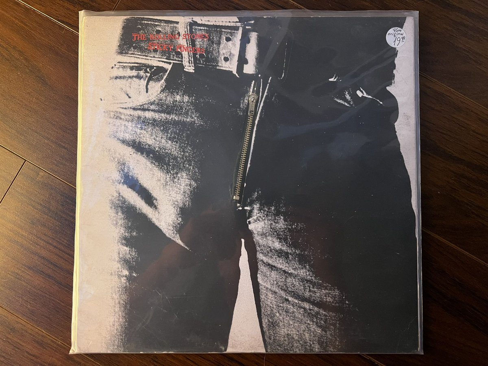
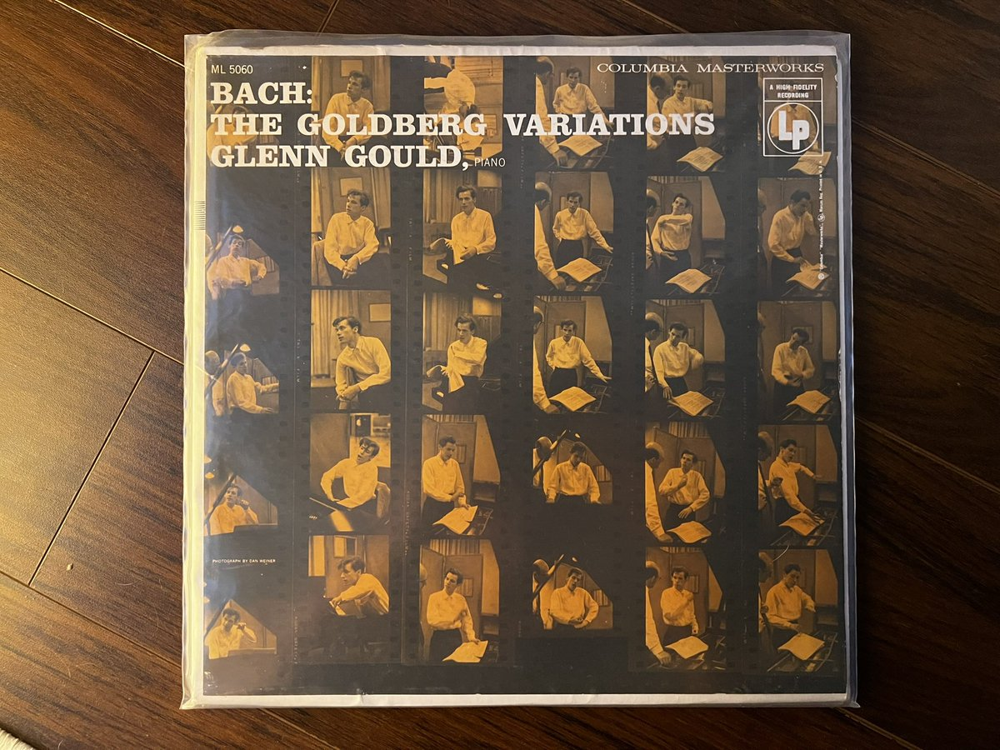
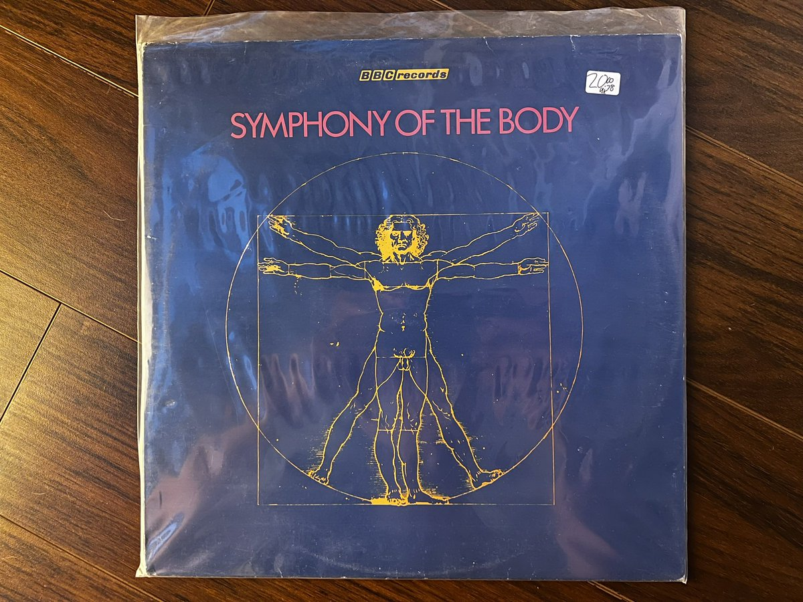

+++
title = "Pup's Steve Sladkowski"
slug = 'pups-steve-sladkowski'
draft = false
date = '2024-12-16T13:46:55Z'

[params]
  feature = 'true'
  [params.featuredImage]
    url = '/conversations/pups-steve-sladkowski/portrait.png'
    alt = 'Guitarist Steve Sladkowski'
  [params.author]
    id = 'staff'
    name = 'I Have That on Vinyl'
+++

Steve talks to us about his record collection and about going record shopping while on tour

<!--more-->

### Would you like to introduce yourself?

Sure, I’m Steve Sladkowski and I play guitar in PUP.

### Let’s talk about your record collection.

I've been collecting since I was in high school. I'm 36 so you have video? I
have everything behind me [shows many shelves full of records]. They are going
all the way down. So I'm, I'm into the kind of, I would say, probably into the
500 kind of 600 pieces at this point. Started with my dad's stuff, he had them
up in the attic where I used to like to play video games and stuff growing up.
And then there was a used record store/bookstore that happened to just be open
within walking distance of where I grew up. So I spent a lot of time there, sort
of on the weekend or whatever the case may be. And that was back when you could
buy an original pressing of *Sticky Fingers* by The Rolling Stones for like, 20
bucks, 25 bucks, stuff like that. So I was lucky to kind of build out as I was
really getting into classic rock, I was able to build out my collection with a
lot of that stuff before it became really, really, really expensive. So I'm
pretty lucky that a lot of stuff in my collection is either stuff my dad bought
new, you know, in the 60s and 70s, or stuff that I found…before that wave of
vinyl collecting in the 2010s, when it really started to ramp up again. And
yeah, now it's basically one of my favorite things to do to waste time on tour.
You know, I'll see where the venue is. I'll look up a bunch of places, record
stores that are walking distance, either from the hotels we're staying at or
from the venue. And you know, sometimes I find some really cool stuff, and other
times I'm just going to kind of look around and look at show posters for the
city we're in, and talk to the people who own the record stores. I worked in a
record store for a long time, but my collection has been kind of built
haphazardly like that.

### It’s nice to start off that way. I got a lot of records from my parents, and you look back and you have all these records from the 60s and 70s. It's a really cool thing to have.

My dad's around now too, still. So he and my mom both still like vinyl, so it's
cool too to have the sort of like, flip happen now where, like, for Mother's Day
often I'll get my mom a record…she has super eclectic taste in music too. So I
can get her, I think, one of the last records I bought her for Mother's Day, or
her birthday was, like, a compilation of Nigerian funk and disco. So it's cool
to be able to find those things and bring them back, not only for myself and my
wife, but also for other people.

### When you buy records on the road, what's the logistics of that? Do you ship them back home to yourself, or do you carry them around with you?

Totally depends. Sometimes we used to travel with vinyl. This is before we
were…before things got a little more professional. And so I used to just put
whatever vinyl we had left over that we were putting in one of our checked bags.
I would just put four or five records that I bought in there. But when I bought
a new check bag, or when I bought a new carry-on, like a rolling suitcase, I
just made sure that I could fit vinyl in there, like, if it was wide enough,
that I could fit an LP right flat on top of my clothes. We've toured enough…
I've got my pack down to kind of a science. And so usually I can fit a handful
of records in my suitcase to bring home with me, or, or I'll just tuck them into
a tote bag and just kind of fake pretend like it's not there.

### Do you have favorite record stores on the road?

Yes…there's a place in Hamburg in Germany that I love called Zardoz Records.
Well, I think there was Academy Records. It used to be in Brooklyn. I don't know
if it's open still [*ed note, they moved a few blocks away and operate as an
annex to the Manhattan store*]. There are some great ones, kind of all over. My
wife [is from] Louisville, so there's great record shopping there. We live in
Toronto, but [there’s] great shopping in Kentucky for records too. Whenever we
go down there, I always check out all the stores. Grimey’s in Nashville, another
good one.

### Do you have a treasured album, one that means the world to you?

Yeah. I mean, I've got a few. Let me see if I can pull them out here. So I do
have an original pressing of *Sticky Fingers* with the zipper. I bought this in
New York City the first time I was there. There's still a sticker you can see
“VG” plus originally was $20.20 US. 

### Wow, I had that when I was a teenager.

It was one of the few my dad didn’t have. What else do we have in here that’s
pretty special to me? This was a gift from the record store..that I worked at
for a long time, a gift from the shop owner because he knew I liked it. It’s an
original pressing of Glenn Gould doing the *Goldberg Variations*, original
Columbia six side pressing from the 50s. I obviously have all the PUP test
pressings which is cool. You know, obviously, getting your own records on vinyl.

[Steve goes through his shelves] What else, what else, here’s a cool one. This
is when I first found out about [the hip hop band] The Roots. Yeah, it was when
I was in college. And I was studying jazz in college and I heard that *Roots
Come Alive* record and it was like the first time I ever really heard live hip
hop. *The Roots Come Alive* came out …’99 so late 90s and I'd only ever heard it
on someone's CD that I ripped and put on my iPod or whatever. And then I was in
Berlin. And again, this was a few years, probably in like 2013 maybe, and I was
able to find an original pressing of *The Roots Come Alive.*

### So when you, when you go to cities, how do you find out about record stores? Do you get word of mouth about them or you just Google? 

Yeah, a little bit of both. You know, sometimes, obviously, like people at
venues, or friends we have, will be able to tell us about those record stores,
or a lot of the time I'll just Google. One of the things about touring is that
there's not like a built-in exercise, like when I'm home and I walk the dog or
whatever, I'm moving around, you can get very, very sedentary on tour. And so
looking for record stores and bookstores, is kind of a nice way to force myself
to move and just kind of get out of the venue and kind of fall into that trap,
so some combination of both, If people really like the record store, if there's
one walking distance to the venue, usually I go and and check it out.

### So when you go into a record store, what’s the first area you head to?

Yea, I will usually go to jazz. I love jazz. I studied jazz growing up so it was
always something that I feel like I was a little bit late, and I feel like
there's still a lot of stuff, whereas like for streaming and like CDs or other
physical media, even it's pretty easy to get a lot of punk, it's pretty easy to
get a lot of pop music and rock music, but I think there's a lot of jazz that's
still sort of haphazardly on on streaming services, right? And so I always try
to go there first, find jazz that I love and see if there's anything. I always
look for Miles Davis records, or I love Ornette Coleman. I love some kinds of
free jazz and some of the freakier kinds of crazier stuff. So, yeah, I'll always
go there. And then from there I tend to go, maybe into some of the electronic or
some of the punk and kind of metal stuff. And then from there I'll kind of go
poke at rock, because that's the stuff also at home I have the most of. So I
look for something different Or just like there's very specific stuff that I'm
looking for. Like, I'm still looking for a copy of *Blue* by Joni Mitchell. I
have a lot of, I have a lot of other Joni Mitchell stuff, but that's one that I
never found, you know, in the wild. I like it to be a little of a hunt.

### Is *Blue* your white whale?

There's that one. I've been looking for a copy of *Shotgun Willie* by Willie
Nelson. And still, to this day, one of my only true regrets of record buying, or
I guess, of not record buying, in this case, is I was in Brighton in the UK, and
there was a 100 pound original pressing of *What’s the Story, Morning Glory* by
Oasis. And at the time, I just couldn't justify that expense, and so I passed on
it. And I still think about it to this day. I just paid way more than that for
Oasis tickets. So that probably is still a bit of a white whale. I can't imagine
that I would get it for 100 pounds anymore. I have a feeling it would be quite a
way more expensive. So those are three that I still think about.

### Have you ever bought an album strictly for the cover without knowing what the album was about?

I think I have done that. I think usually there would be something interesting
to me about it. A lot of those records tend to be like, like strange, kind of
like library music, or sort of like non, almost like non musical records. So, I
have this record that is basically body sounds. I have a fascination with some
of these records. I didn't even realize it was a thing, and then once I found
out it was a thing, I would look for something specific. So there is a BBC
recording from 1978 called *Symphony of the Body*. And I just thought it was
cool because it has  the Vitruvian Man on the front. [It has] the heart, a bad
heart, a Doppler ultrasound, an irregular heartbeat, a hungry stomach, muscles
of the thumb at work, and they're just like recordings of different functions of
the human body. 

I think I got this [holds up record] at Zardoz in Hamburg, that record store
that I was talking about, which is the sound of speech after the removal of the
larynx. Who knew there was a record of this? So this is all stuff that I just
find myself going into a record store, when I go into those sections and I'm
like, where's the weird shit? Like, where's the shit that's not that something
you would never think would be on a record, you know? And so I have a handful of
those. Like, I'm really obsessed with these, like the moon landing. There are a
bunch of records about the moon landing, we came in peace for all mankind. And
one giant step. Kind of fun, like they're fun little artifacts, you know? So
these are strange. I have just enough space that I can fit some of that into my
collection without having to sacrifice Black Sabbath or something.

### The last question I ask everybody is, what is the one album you would play for company?  You want to take out a nice record for a bunch of people to listen to.

[takes out records] That’s when I tend to bring out..this is an original
pressing of *Milestones* by Miles Davis. And this is *Miles Smiles*, I got this
in Asia. Yeah, this is a Japanese pressing. Usually the jazz, usually, I bring
out the jazz, you know, the coolest, how does that not just impress, right? You
know, it's one of the coolest record covers, an old Columbia. It's an old six
side pressing.

### That’s a nice way to wind down an evening.

There’s something about listening to jazz on vinyl that sounds a very specific
way. I think it is one of the art forms that is so connected to the medium. I
find with a band like Wilco, I actually don't find great on vinyl, because if
you think about a record like *Yankee Hotel, Foxtrot *and the production that
Jim O'Rourke did on that record, it all kind of bleeds into one as you're
listening to it, it's kind of just like *Yoshimi Battles the Pink Robots* by
Flaming Lips. I think it's a similar sort of thing. All those records kind of
bleed, they use the CD’s longer run time and like longer unbroken runtime, to
their advantage, like an artistic statement. So I find that sometimes when you
buy those records after they've been reissued on vinyl, it sort of breaks up
that part of the artistic statement in a kind of an unnatural way. Whereas with
jazz, there was always an understanding that flipping the record, the actual
mechanical act of flipping the record, is part of the listening experience in a
more fundamental way. So that sort of stuff, I think, is really kind of an
interesting way of engaging with the different types of physical media.

*Steve Sladkowski is the guitarist for the Toronto-based punk rock band PUP. He
has been collecting vinyl for over 20 years, and has shopped in record stores on
four continents, but still hasn’t found an original pressing of Joni Mitchell’s
“Blue.”*
