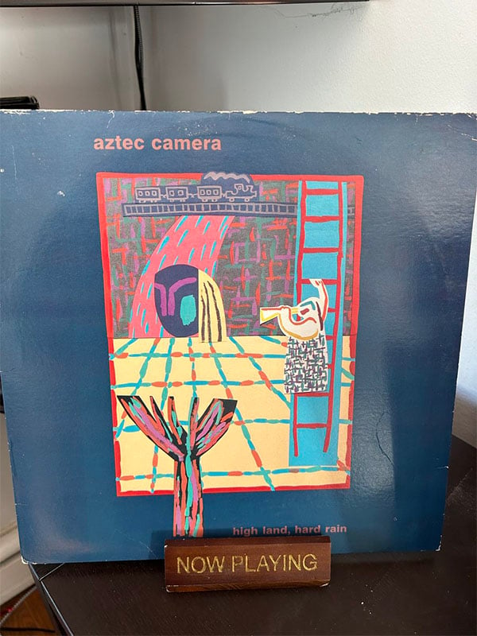

+++
title = "WALK OUT TO WINTER: falling in love with - and to - aztec camera's high land, hard rain"
slug = 'walk-out-to-winter'
draft = true

[params]
  [params.author]
    ID = 'mcatalano'
    Name = 'Michele Catalano'
+++
# WALK OUT TO WINTER: falling in love with - and to - aztec camera's high
land, hard rain

my original 1983 copy

It's snowing; thick, large flakes coming down at the rate of two inches an hour.
Work is closed and I don't have to go anywhere until Wednesday afternoon, so I'm
huddled up on the couch with a cup of tea, writing this and occasionally looking
up to see if it's still snowing. Part of me wants it to snow all day. I love the
feeling of being homebound, forced by winter to do nothing but cuddle with cats
and listen to music.

As I do when it snows this hard, I place Aztec Camera's *High Land, Hard Rain*
on the turntable and settle in. It's my favorite album of all time, a title I
gave it just a few weeks ago. I'd never know what to say when people ask me what
my favorite record ever is; I would stammer and stutter and try to list ten
albums in ten seconds because I was incapable of landing on one single one. I am
61 years old, I've had enough favorite albums in this life to fill a record
store. *Led Zeppelin IV, OK Computer, Songs for the Deaf*, the music I love
spans many decades and many phases. But Aztec Camera is not a phase. It never
was. I have been listening to it at least weekly since 1983.

I am working at a Sanrio store in Roosevelt Field mall on Long Island. It is
early November, 1983. I have no idea what I want to do with my life. I'm 21 and
sort of just floating through my days, hoping something interesting presents
itself. It's getting close to Christmas season and I'm not ready for the throngs
of overbearing mothers who enter the store in search of the perfect stocking
stuffers for their pre-teens. Stickers, erasers, pencil and notebooks, all with
Hello Kitty and friends emblazoned upon them. The store has a very particular
smell, as if someone bottled up whimsy and sprayed it throughout the aisles. I'm
not meant to be here. I am a punk rocker, a new waver, a rebel. Corralling
tweens and keeping the high school kids from shoplifting Hello Kitty day
planners is not a good look for me.

Then in walks fate. Short, skinny, wild hair, and John Lennon glasses, this guy
looks like he was put together with parts from Misfit Island. He takes one look
at me when he gets to the register and says "You don't look like you should work
here." I have no idea what he means but I don't have time to ask because he
takes a pen off the counter, grabs my hand, and writes on it. *Ed. Record
World*. I stare at this little intense man, intrigued more than worried. I look
at my hand, I look at Ed. "Come work for me at Record World. Stop in on your
break." And with that, he leaves.

Ed hires me on the spot when I get to Record World. He hands me a blue vest, a
blue Sharpie, and tells me to start tomorrow. I go home instead of going back to
the Sanrio store. My life will never be the same.

When I said Ed walked into the Sanrio store as fate, I meant it. So much would
change that day as I embarked on a journey to four of the best years of my life.
I became a different person. I was so good at my job and was routinely told how
valuable I was to the company. This gave me a confidence I was sorely lacking.
When my then boyfriend saw a difference in my personality, when I started making
friends at work and going out with them instead of staying home every night with
him watching *Every Which Way But Loose,* he demanded I quit my job or he would
leave me. So I left *him*. And, thanks to fate in the form of Ed, I was about to
fall in love.

It is late December 1983. The Christmas rush is over and I'm home sick. I worked
twelve days in a row, open to close, and ended up with laryngitis and a cold
from being run down. I'm in my bedroom listening to R.E.M.'s *Murmur* for the
hundredth time as a snowstorm starts up outside. I survey my room, wondering
what I would put up on my wall next. My posters had come down recently; Todd
Rundgren and Bruce Springsteen and the Grateful Dead gave way to a haphazard
collection of album covers affixed to the wall with thumbtacks (I got in so much
trouble for that). New Order, the Police, The The, Echo & the Bunnymen, Split
Enz; typical fare for someone who is getting deep into new wave. Working at the
record store affords me a lot of music I wouldn't otherwise own. We get our
bonuses in records or tapes and I've been earning a lot of bonuses.

My mother knocks on the door to tell me I have a visitor. I am not expecting
anyone so I am surprised to see a coworker standing at the door. Not just any
coworker, but the one I have a crush on. He was the first person I met at the
store besides Ed and was incredibly kind to me; he had my back when my deranged
ex came into the record store looking for me. We spend many nights in the local
pub, drinking beer and watching hockey and talking about our lives. I know I'm
falling for him but I don't know how deep I am until I see him standing there in
my doorway. He's holding a Record World bag in his hand and we kind of just
stare at each other as I fight the urge to giggle. He shoves the bag into my
hands and I'm so nervous I drop it. Now I'm embarrassed. I can feel myself
turning red. He picks up the bag, and pulls a record out. "This is for you," he
says. "Get well present." My heart is pounding, my hands are sweating, my throat
has gone dry. I still have laryngitis and I try to eke out a thank you. He
smiles at me and I melt a little. I look at the album and recognize the cover
from the store. It had been on the wall for a while but I never gave it a
listen. It's Aztec Camera's *High Land, Hard Rain. *"I don't know if you've
heard this before, but it's a favorite of mine and I think you'd really like
it." I smile back at him. "Thanks," I whisper, and I hope he can hear the
gratitude in it.

It is later that afternoon. The snow has been coming down since this morning and
a bluish hue is cast across the lawns of Long Island as the sun starts to make
its exit. I have decided this is a good time to listen to my new album. My get
well *gift. *I swoon a little thinking about it. He came out in the snow to give
this to me. Was it just kindness or something else? I drop the needle on
"Oblivious" and I'm delighted to recognize the song. I sit back on my bed,
headphones on, and let the album take over. My life will never be the same.

I connected immediately with the album. Sitting there on that snowy night,
letting everything wash over me - the beautiful harmonies on "Walk Out to
Winter," the clever lyrics, the emotion, and the yearning. Oh, how Roddy Framed
*yearned*, and there I was, yearning with him, reaching out to grab something I
wasn't sure was there. I ran my hands over the cover, thinking about my coworker
staring at the wall of records in the store, thinking about which one to gift
me. And he picked that particular one, knowing I would like it, knowing me well
enough to realize this was something that would resonate with me. I loved him
for that. I listened to *High Land, Hard Rain* seven times before I fell asleep,
two verses into "The Bugle Sounds Again." Each spin I fell harder and harder in
love; with the album, and with him. I fell asleep in prayer of sorts, thanking
Ed for playing the part of fate and thanking Aztec Camera for existing.
Everything would be different now, I thought. Everything would be good. And it
was, for a bit.

We dated, got married six years later, had two kids, divorced in 1997. It *was*
happily ever after for a few years or so before things turned. I regret nothing.
He brought two wonderful kids into my life and I will always be grateful to him
for bringing *High Land, Hard Rain* into my life as well.

January 2024. I'm sitting in my living room listening to Aztec Camera. I run my
hands over the same cover I did in 1983. I've kept this album through several
moves and at least one vinyl selling binge. And here I am, 41 years later,
listening to the very same album I got as a get well gift from a guy who I was
unaware had been courting me. I was oblivious.

I say it out loud then, for the first time, *this is my all time favorite
album*.

I think I knew it all along.

