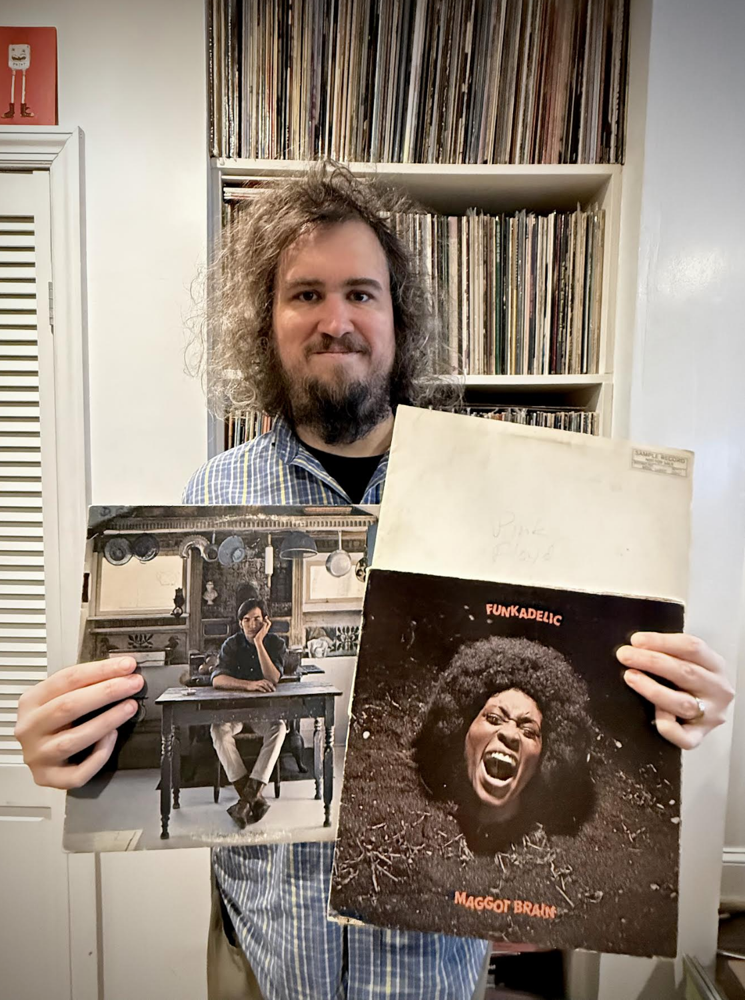

+++
title = "Q&A Remix with Matthew Millgan from Wheatus"
slug = 'matthew-millgan-remix'
draft = true
date = '2024-12-16T14:06:00-0500'

[params]
  featured = 'false'

  [params.author]
    id = 'staff'
    name = 'I Have That on Vinyl'

+++
Today's Q&A Remix is with Matthew Millgan from Wheatus

### What is your most memorable vinyl buying experience?

I was at a shop and saw an original pressing of the self-titled Townes Van Zandt
LP up on the wall for $80.  I knew that was a very rare find and a very fair
price, but at the time it was still way over my budget. I walked around the
store carrying it and agonizing over my decision for maybe an hour until I
decided I had to have it.  Walked up to the counter to pay, and the clerk told
me they were having a special sale on used vinyl this weekend and it was 50% off
the sticker price.  That may have been the happiest I’ve ever left a record
shop.

### What’s the first area you head for in a record store?

Nowadays I like to look at the wall displays first - usually I find the most
interesting stuff up there. If there’s a ‘New Arrivals’ bin (there always should
be, by the way) then that’s a must visit.  And I’ve been collecting for a long
time, so if there’s a bin marked “Rare” I can’t resist a close look through
that.

### What’s the most treasured album in your collection and why?

I have a Mobile Fidelity Sound Lab test pressing of *Dark Side of the Moon* that
I’m quite proud of. Or an original mono promo copy of *Introducing The Sonics.*
Oh, or an original UK pressing of *Revolver* with the alternate withdrawn mix of
"Tomorrow Never Knows."  Don’t make me pick just one.

### What one record in your collection would you be most eager to share with new friends?

Tom Waits - *Mule Variations*.  Not necessarily my favorite album of his, but
boy does that pressing just sound incredible.  When I put that on it stops
people in their tracks.

### Which artist do you have the most records from?

I used to be more of a “full discography” kind of guy but as my collection grew
I had to become a little more discerning or I’d absolutely fill my home. My
all-time favorite band is probably They Might Be Giants - according to Discogs
I’ve got 35 TMBG titles at the moment (across LPs and 7”s).  As long as they
keep making records, I’ll keep buying them

### What is/are your white whale records?

I’d love to own a copy of the original *The Nerves* 7” from 1977 - that’s my
power pop holy grail. There’s also a 7” by Y. Bhekhirst called *Hot In The
Airport* that’s one of my favorite pieces of experimental/outsider art I’ve ever
heard.  Weird to have two 7”s on here as I don’t even feel like I collect those
very much!  I’m also still searching for an original pressing of Can - *Tago
Mago*.  

### What is your greatest “score;” could be on value or just rarity or something you were looking for the longest?

I spent years searching for an original pressing of Funkadelic’s *Maggot Brain* -
one of the greatest albums of all time as far as I’m concerned.  Finally found
it at a record shop in Cleveland a little while back - and for a very fair price
no less.  I’ve never grabbed an LP quicker!

### Do you have a favorite live record?

Townes Van Zandt - *Live at the Old Quarter*.  No question.

### Who/what got you hooked on records?

When I was a teenager I bought CDs. As I started to get into older artists, it
was pointed out to me by a friend that you could actually get a lot of that
music on used vinyl for way less money than CDs.  Nowadays that seems insane but
in 2001 it was absolutely true!  So I bought a bunch of classic vinyl (Bruce
Springsteen, Hall & Oates, Fleetwood Mac, Prince, etc.) for something like a
dollar each and played them on my parents’ old turntable that they hadn’t used
in over a decade.  Instantly hooked.  The first new release I bought on vinyl
was Bright Eyes *Lifted* and from then on I started buying just about everything
on vinyl over CD.

### What are your first memories of listening to records?

I went to my local public library and would sit at their listening station and
put on the album *Chilling, Thrilling Sounds of The Haunted House* which was
essentially short ghost stories accompanied by spooky sound effects. I still
love records and horror films so those visits definitely made a big impact.

### What’s your favorite record to listen to on headphones?

Brian Eno - *Ambient 1: Music for Airports*.  It’s the most soothing album ever
made, and if I’m listening with headphones I almost never make it to the end
before falling into the most peaceful sleep ever.

### What genre is most represented in your collection?

I’m generally a pop/rock guy but to be more specific it’s probably power pop.
The Knack, Joe Jackson, The Cars, Nick Lowe, Raspberries, Shoes, Big Star, Cheap
Trick, Sorrows, Dwight Twilley, The Records, The dB’s, The Plimsouls, Speedies,
The Replacements, The Flamin’ Groovies… how are they all so good?!

### Tell us a little about your favorite record store.

This is of course highly biased but I used to manage a record shop in Brooklyn
called “Permanent Records” that closed a few years back, but we all worked
really hard to make it the best shop we possibly could. After losing that place
to the brutal world of NYC real estate, I would now say my favorite shop to
visit is Academy Records.  I’m always partial to used LPs over new, and their
bins are always full to the brim with exactly the sort of stuff I’m looking for.
I almost never walk out of there without something amazing in hand.

### What’s the weirdest record you own?

That’s a tough call as I own a LOT of music made by Avantgarde / outsider
artists.  If I have someone over I want to scare away, Scott Walker’s *The
Drift* or Jandek’s *Ready For The House* typically get the job done. 

---

Matthew Milligan has been a professional musician since 2006, best known for his
work with **Wheatus** (“Teenage Dirtbag”), **Mike Doughty** (Soul Coughing),
**MC Frontalot** (Nerdcore Rising), and **MC Lars** (“Download This Song”).  In
various roles and on multiple instruments he has performed alongside Vernon Reid
(Living Colour), Dan Wilson (Semisonic), Billy Martin (Medeski Martin & Wood),
Wayne Kramer (MC5), Money Mark (Beastie Boys), Marc Ribot (Tom Waits), Josh
Devine & Sandy Beales (One Direction), Bowling For Soup, Corn Mo, “Weird Al”
Yankovic, Jean Grae, Mega Ran, Schaffer The Darklord & more.  He is a writer /
producer / founding member of NYC based groups **Fashion Bird Danger Danger** &
**Grim All Day**, as well as long distance electronic collaboration **Maeges**.
He hosts the “**Weird Al-Gorithm**” podcast on the Geekscape Network, and was
invited to moderate a "Weird Al" themed panel at the **2024 San Diego Comic
Con.** On the technical side, he worked as an engineer on“**Gilbert Gottfried’s
Amazing Colossal Podcast**” from 2020 until Gilbert's passing in 2022, and he
mixed the Wheatus live album **M (Live in America)**, first released in 2020.
He worked at / managed the beloved vinyl record shop **Permanent Records** in
Brooklyn, NY from 2009 until its closing in 2017.
